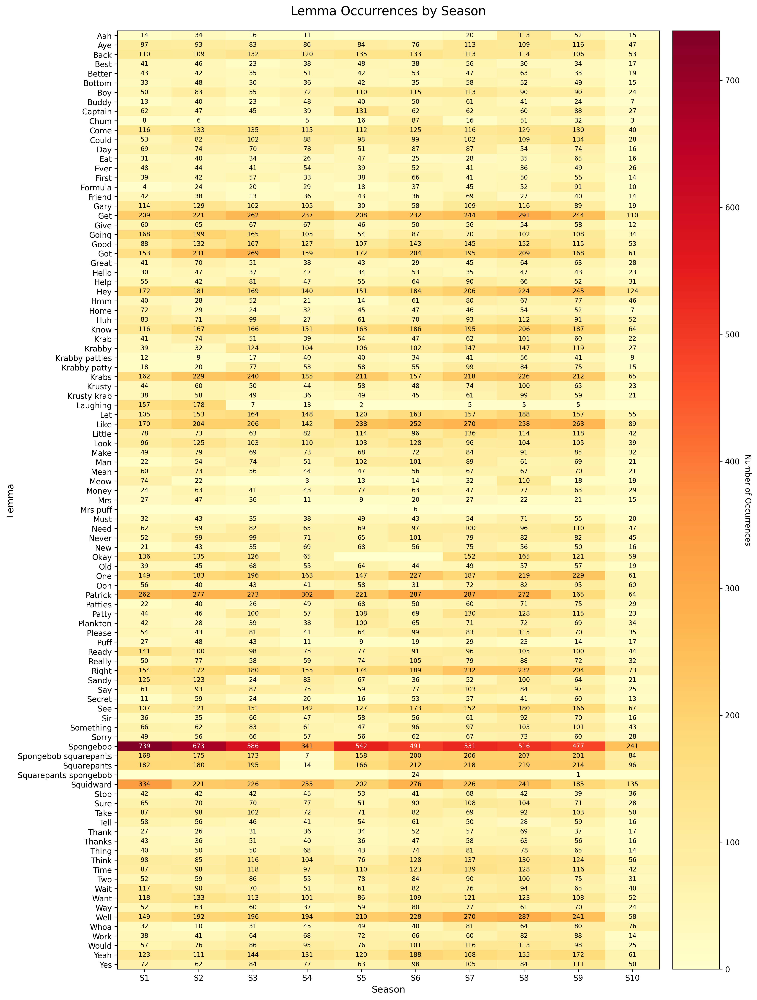

Scripts for processing closed-caption SRT files. You can batch download on opensubtitles.com or opensubtitles.org (it costs $3 for one month of "VIP").

Conversion from .SRT to .txt is simple regex, but the `normalize_captions.py` script will do that for you. The expected structure is:

```
scripts/
    Season 1/
        Episode 1/
            S01E01.srt
        Episode 2/
            S01E02.srt
        ...
    ...
```

The `process_episodes.py` will extract lemmas and their contexts from the normalized TXT files and save them to a JSON file. `sb_targets.txt` is a list of lemmas to extract. 

There is also a `filter_duplicate_scripts.py` script that will filter out duplicate scripts using semantic similarity. The opensubtitles data is very messy so this might come in handy.
